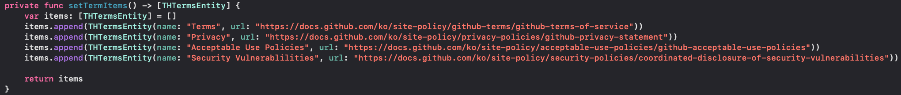

# DWTermsViewController
#### Super Easy Terms View.

# Feature
- [x] pure swift 5.0 code

# Installation

#### Swift Package Manager
Simply add THSegmentControl to your `Package Dependancies`.

Add only url 'https://github.com/aboutyu/DWTermsViewController.git' into Package Dependancies

# Usage

You must create UIViewController and it add [THTermsEntity] array.

Then you must also move to DWTermsViewController using Present()

You can see as below screen.



The following sample code for your reference.

```swift
import UIKit

class ViewController: UIViewController {

    @IBAction func btnTapped(_ sender: UIButton) {
        let vc = DWTermsViewController(setTermItems(), startedItem: 0, selectedColor: .blue, diselectedColor: .red, isTitleHide: true)
        present(vc, animated: true)
    }
    
    override func viewDidLoad() {
        super.viewDidLoad()
    }

    private func setTermItems() -> [THTermsEntity] {
        var items: [THTermsEntity] = []
        items.append(THTermsEntity(name: "Terms", url: "https://docs.github.com/ko/site-policy/github-terms/github-terms-of-service"))
        items.append(THTermsEntity(name: "Privacy", url: "https://docs.github.com/ko/site-policy/privacy-policies/github-privacy-statement"))
        items.append(THTermsEntity(name: "Acceptable Use Policies", url: "https://docs.github.com/ko/site-policy/acceptable-use-policies/github-acceptable-use-policies"))
        items.append(THTermsEntity(name: "Security Vulnerablilities", url: "https://docs.github.com/ko/site-policy/security-policies/coordinated-disclosure-of-security-vulnerabilities"))
        
        return items
    }
}
```

# License

DWTermsViewController is available under the MIT license. See the LICENSE file for more info.
